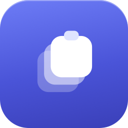
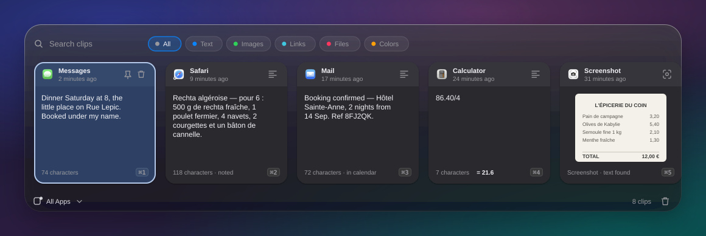
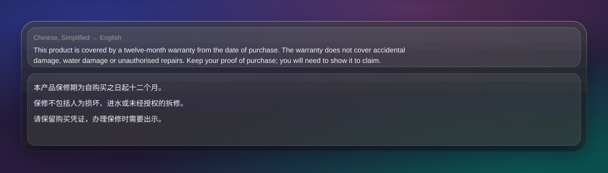
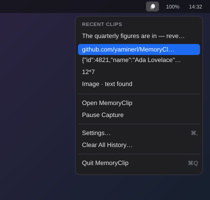
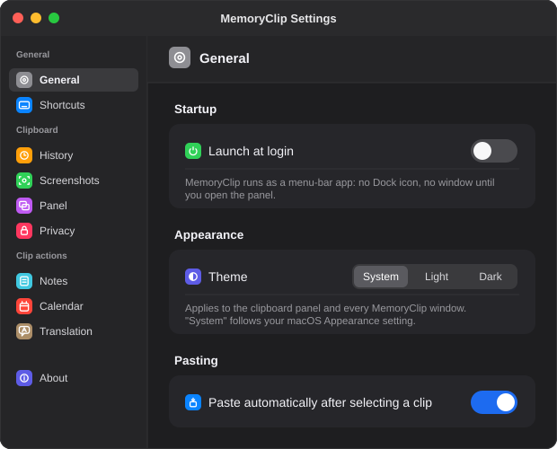

<p align="center">
  
</p>

<h1 align="center">MemoryClip</h1>

<p align="center">Your clipboard, remembered. Locally.</p>

<p align="center"><a href="https://yaminerl.github.io/MemoryClip/"><strong>Download and install →</strong></a></p>

<p align="center">
  <a href="https://github.com/YamineRL/MemoryClip/actions/workflows/ci.yml"></a>
  <a href="https://www.paypal.com/donate/?hosted_button_id=H8XWE3HUPKCME"></a>
</p>

A local-first menu-bar clipboard manager for macOS: keyboard-first history of everything
you copy. It also notices your screenshots, reads the text out of them — 30 languages,
translated into English when it is not one you read — and turns one into a note in
**[Obsidian](https://obsidian.md)**, any other folder of Markdown, Apple Notes, or a
Shortcut.

**Zero network calls**: no sync, no analytics, no accounts. Clips live in a local
SwiftData store, and the models that read, tidy and translate run here too. The only files
written anywhere else are the notes you asked for, in the folder you chose, and the
calendar events you asked for.

Requires macOS 26 on Apple silicon.

## Screenshots

<table>
  <tr>
    <td colspan="2"></td>
  </tr>
  <tr>
    <td colspan="2" align="center"><em>The panel — <strong>⇧⌘V</strong> from anywhere.</em></td>
  </tr>
  <tr>
    <td width="50%"></td>
    <td width="50%"></td>
  </tr>
  <tr>
    <td align="center"><em>Preview pane — <code>Space</code> to open, again for Quick Look.</em></td>
    <td align="center"><em>Menu-bar dropdown — the last five clips.</em></td>
  </tr>
  <tr>
    <td colspan="2" align="center"></td>
  </tr>
  <tr>
    <td colspan="2" align="center"><em>Settings — ten panes behind a sidebar, no Dock icon anywhere.</em></td>
  </tr>
</table>

## Install

```sh
brew tap yaminerl/memoryclip https://github.com/YamineRL/MemoryClip
brew trust yaminerl/memoryclip
brew install --cask memoryclip
```

The tap line takes a URL because this repository *is* the tap
([`Casks/memoryclip.rb`](Casks/memoryclip.rb)); the trust line is Homebrew 6, which will
not load third-party casks until you vouch for them. `brew upgrade`, `brew uninstall` and
`--zap` work as usual after that.

**By hand**: the [install page](https://yaminerl.github.io/MemoryClip/#install) walks through this
with screenshots. In short: download the `.dmg` from
[Releases](https://github.com/yaminerl/MemoryClip/releases) and drag it to Applications.
The app is **ad-hoc signed** — no Developer ID, no notarisation — so Gatekeeper blocks the
first launch until you strip the quarantine flag, which is all the cask does for you:

```sh
xattr -dr com.apple.quarantine /Applications/MemoryClip.app
```

There is no Dock icon either way. Press **⇧⌘V**, or find the clipboard glyph in the menu
bar. **Launch at login** is in **Settings → General**.

## Using it

⇧⌘V opens the panel from any app, newest clip first, list already focused. The menu-bar
glyph gives the last five clips under a **Recent Clips** header, then Open MemoryClip and
Pause Capture, then Settings and Clear All History, then Quit — the irreversible one kept
a separator away from the item people actually come to click.

| Key | Does |
| --- | --- |
| `↑` `↓` | Move through the list (`←` `→` as well, while the search field is empty) |
| `Return` | Paste the selected clip |
| `⇧Return` | Paste it as **plain text**, dropping fonts and colours |
| `⌘1`–`⌘9` | Paste any of the first nine results directly |
| `⌘S` | Save the selected clip as a note, if it carries any text |
| `⌘E` | Add the selected clip to the calendar, if it names a date |
| `Space` | Open the preview pane; press it again on a picture or a file for full-size **Quick Look** |
| `Esc` | Close Quick Look, then the preview, then the panel |

Pasting puts the clip on the clipboard, reactivates your previous app and sends a ⌘V. If
macOS blocks that synthetic keystroke the clip is still on the clipboard — see
[Permissions](#permissions).

Hold `←` or `→` and the list walks at about eight clips a second — MemoryClip's own pace
rather than the key-repeat rate in your Keyboard settings, which at its fastest is a blur
that overshoots by a dozen clips before a finger comes off the key. The preview waits
until you stop, so a run of forty clips loads one rather than forty. The keys that delete,
paste or pin never repeat, whatever you do to them.

Inside Quick Look the arrows keep working, walking full-size through the pictures and
files of whatever you had filtered, and the one you stop on is the one selected when you
come back out.

**Search** matches clip text, text recognised inside images, the model's summary, colour
values, file names and the source app, with chips for **All, Text, Images, Links, Files,
Colors**. It runs in the database over an index, a page at a time, so tens of thousands of
clips filter like an empty store — paging bounds what is *drawn*, never what is
*findable*.

**Along the way** it badges emails, URLs, phone numbers, JWTs and JSON, shows `= 84` under
a copied `12*7`, and offers a QR code for links. Right-click to transform a clip on the
way out — case, JSON, Base64, URL encoding, sort or dedupe lines — or **Add to Queue**,
and **Paste N** sends the lot in order.

**Translation** — off by default, **Settings → Translation → Clip preview**. Copy
something in a language you do not read and the preview shows it in one you do, above the
text as it was copied; a screenshot or an image is translated from the text recognised
inside it. The target starts as whatever language this Mac is set to read. It happens when
you open the preview rather than when you copy — a clipboard is mostly things nobody looks
at twice — which costs a second or two the first time and nothing afterwards, since the
answer is kept on the clip. The work outlives the panel, so clicking away mid-translation
loses nothing.

**Vim navigation** — off by default, **Settings → Panel**. Properly modal, the mode shown
in the search bar. In NORMAL:

| Key | Does |
| --- | --- |
| `j` `k` | Move down / up (`l` `h` too — the strip of cards runs left to right) |
| `gg` `G` | Jump to top / bottom |
| `⌃d` `⌃u` | Half-page down / up |
| `o` | Paste (`⇧O` pastes as plain text) |
| `p` | Pin the clip |
| `dd` | Delete the clip, after a confirmation |
| `q` `⇧Q` | Add to the queue / paste the whole queue |
| `n` | Save the clip as a note (`⌘S` does the same in either mode) |
| `c` | Add the clip to the calendar (`⌘E` does the same in either mode) |
| `/` `i` | Fresh search / edit the existing query → INSERT |

**Housekeeping.** The newest 200 clips are kept and anything older than 30 days is swept,
both adjustable in **Settings → History**, both exempting pins. Re-copying bumps a clip to
the top instead of duplicating it. Pause capture from the menu bar, clear everything from
the dropdown or the panel, and export to JSON or CSV from **Settings → History**.

## Screenshots into notes

⇧⌘3, ⇧⌘4 and ⇧⌘5 write a file and never touch the clipboard. Turn on
**Settings → Screenshots → Keep screenshots in history** and MemoryClip watches that
folder instead. Off by default, since it needs a folder macOS guards, and it starts from
your next screenshot rather than the last four years of them.

Screenshot clips are **links, not copies**: the file stays where it is, with a thumbnail
for the row. Deleting a clip never touches it, and **Reveal in Finder** opens it.

Vision reads the text inside images on-device and folds it into search, so you can find a
screenshot by words that appear *in* it — 30 languages, detected rather than assumed.
Those rows read `text found`.

A screenshot **of a table comes back as a table**. Columns are recovered from where the
words sat on the page, stored as Markdown, drawn as a grid in the preview and carried into
notes — a real `<table>` in Apple Notes, a Markdown table in a vault.

### Notes

Any clip with text can become a note: right-click → **Save as Note**. **Apple's on-device
model** first fixes OCR slips, rejoins wrapped lines, drops interface chrome and writes a
title, summary and tags. The raw recognition is kept alongside it, and is used outright
when the model is unavailable or when a rewrite drops or invents too much of the text.

A screenshot that is not in English is **translated on this Mac** and the note carries
both — the text as it was on screen, and an English translation under it. Always English,
whatever language the preview translates clips into: title, summary and tags come from it,
so a note captured in Arabic is findable in a vault you search in English. Tick the
languages you want in **Settings → Translation → Notes** (22 on macOS 26) and macOS
fetches what it needs; with none ticked it handles whatever this Mac already can.

Three destinations, in **Settings → Notes**:

| Destination | What it does | Needs |
| --- | --- | --- |
| **Markdown folder** | Writes a `.md` file with YAML front matter — an Obsidian vault, or any folder of Markdown — filed under the month and day it was captured. The screenshot is copied in and embedded, so the note survives you clearing your Desktop. | A folder you pick |
| **Notes** | Creates a note in Apple Notes, in a folder you name. The screenshot goes in as a link — Notes does not accept an image through automation. | Automation permission |
| **Shortcut** | Runs a Shortcut with the note as its input, so Bear, Things, DEVONthink or anything else Shortcuts reaches can be the destination. | A Shortcut name |

Notes are written when you ask, or automatically above a text threshold if you turn on
**Write a note for every screenshot**. A clip that has one reads `Screenshot · noted` and
offers **Update Note**, which rewrites the same file — even one you moved or renamed
inside your vault.

### Where notes go

Every note is a plain `.md` file named `2026-08-13 1422 Title.md` — timestamp first, so
two shots of the same window do not collide and a note that ends up somewhere else still
says when it is from. Notes are filed by the day they were captured:

```
26-08 August/
  13/
    2026-08-13 1422 Deploy checklist.md
```

The month folder leads with the year so a vault you have kept for a few years walks in
order instead of restarting each January, and the day folder keeps a heavy week down to
something you can look at. Turn **Sort notes into folders by date** off in
**Settings → Notes** and notes go straight into the folder you picked, as they always
did. Either way nothing already written is moved: a note you saved last year keeps being
updated where it sits, and the screenshot always goes to the single `attachments` folder,
since an `![[embed]]` finds it anywhere in the vault.

Inside, the note itself:

```markdown
---
title: "Deploy checklist"
created: 2026-08-13T14:22:03Z
source: "Screenshot"
tags: ["deploy", "release"]
lang: "en"
memoryclip-uuid: 5B7C2A19-3E64-4C0F-9A11-8D2F6E0B4A73
screenshot: "/Users/you/Desktop/Screenshot 2026-08-13 at 14.22.01.png"
---

# Deploy checklist

> A four-step release checklist, screenshotted from the team wiki.

![[2026-08-13 1422 Deploy checklist.png]]

1. Freeze the branch and tag it.
…

## Original text

*Exactly as recognised, before the on-device model cleaned it up.*
```

Every string is quoted because a heading with a colon in it would otherwise rewrite the
note's own metadata. `screenshot:` points at the original file even when a copy was made,
`memoryclip-uuid` lets an update find the note it wrote last time, and `created` is UTC
for Dataview while the file name is local time, for you.

Anything that reads Markdown off disk opens one. Apps differ on two things only — front
matter, and wiki-style `![[embeds]]` — which is what the **Copy the screenshot into the
folder** switch is for: on, the picture is copied in and embedded; off, the note links to
it where it sits, in a form every editor renders.

- **[Obsidian](https://obsidian.md)** — your vault, or any folder in it, copying **on**
  and dated folders **on**: it walks subfolders, and its own attachment setting is the
  flat folder these notes already use. Front matter becomes note properties, so tags are
  tags and `lang`, `source` and `created` are Dataview-queryable.
- **[Logseq](https://logseq.com)** — the `pages` folder of your graph, attachments set to
  `assets`, and dated folders **off**: a Logseq page is named by its file, and any
  hierarchy is spelled into that name rather than into folders, so a dated tree buys
  nothing the graph can use.
- **[iA Writer](https://ia.net/writer)**, **[Typora](https://typora.io)**,
  **[Zettlr](https://www.zettlr.com)**, VS Code — any folder they watch, copying **off**.
  All four open a folder and show its subfolders, so leave the dated folders on unless
  you would rather scroll one long list.
- **[DEVONthink](https://www.devontechnologies.com/apps/devonthink)** — index the folder,
  so notes stay files MemoryClip can update in place.
- **[Joplin](https://joplinapp.org)** — import, and re-import after later edits.
- **iCloud Drive, Dropbox, Syncthing** — notes are written whole, so a half-written file
  never syncs.

Bear, Craft, Notion and Things keep no files: use the **Shortcut** destination. A shorter
version of this list is in the app, under
**Settings → Notes → Which apps can open these notes?**

## Dates into events

A clip that names a time — an invitation pasted out of an e-mail, a screenshot of a
meeting request, a line someone sent you in chat — becomes an event in Calendar.
Right-click → **Add to Calendar**, **⌘E**, or `c` in vim mode.

What it reads is what macOS reads: the same detector that underlines "Thursday at 3" in
Mail, so it understands the forms people actually send, in every language the system
ships. Around that it looks for the two things that turn a date into an appointment — a
video-call link (Zoom, Meet, Teams, Webex and the rest) and a postal address — and takes
the title from the line above the details, which is where an invitation puts its subject.
A date with no clock time becomes an all-day event rather than an hour at noon.

Turn on **Add events automatically** in **Settings → Calendar** and a clip that is plainly
an appointment is filed without being asked. *Plainly* is the whole of it: the text has to
name a time of day **and** carry either a meeting link or an address. A bare date does not
qualify, and that is deliberate — "Q3 ends September 30" is a date, a receipt has a date,
an article has a date, and a clipboard manager that turned every one of them into a
calendar entry would be something you switch off rather than something you rely on.
Everything weaker still gets the button.

An automatic event announces itself with a notification carrying **Undo**, which takes it
back out again. Either way the clip row reads `· in calendar`.

## Privacy and security

Everything happens on this Mac — a local SwiftData store, and no network calls at all.

- **The store is owner-only**, at `~/Library/Application Support/app.memoryclip/` —
  directory `0700`, files `0600`.
- **Password managers are skipped**: the standard pasteboard opt-out markers
  (`org.nspasteboard.TransientType`, `AutoGeneratedType`, `ConcealedType`), and known
  credential apps outright.
- **Card numbers are never captured** — Luhn-validated numbers are dropped from plain
  text, rich text, OCR output and translations alike.
- **Detection is app-identity based**: bundle identifier and name, never window titles or
  the screen, which is why no Screen Recording grant is needed.
- **The model and the translator are local.** Foundation Models and Translation run
  on-device with no cloud fallback.
- **Notes leave the store on purpose** — a note is a file in your folder, with that
  folder's permissions rather than the store's `0600`.
- **Optional Touch ID lock** gates the panel, redacts the dropdown to clip kinds, and
  always re-authenticates for Export and Clear All History.

VoiceOver is supported throughout: rows carry labels for kind, content and state, mode and
selection changes are announced, and every row action is reachable from the keyboard.

## Permissions

**None** for the core job: capture, store, search, and copy clips back. No Screen
Recording, no Input Monitoring, no network. Optional, and only with the matching feature:

- **Files and folders** — to read your screenshot folder and write notes into the one you
  pick. Each grant is kept as a *security-scoped bookmark* rather than a path, so it
  outlives a relaunch, and MemoryClip never reaches into a folder you did not point it at.
- **Automation** — only when Apple Notes is your note destination.
- **Calendars** — only to add an event you asked for. The grant requested is *write-only*:
  it can create events and cannot read one. That is also why an event goes to your default
  calendar and there is no picker — listing the others would need the read permission this
  feature is deliberately not asking for.
- **Accessibility** — only to auto-paste with a synthetic ⌘V. Without it the clip still
  reaches the clipboard.

## Settings

Ten panes in a sidebar; ↑/↓ move between them, ⌘W closes the window, and it reopens
where you left it.

| Group | Pane | Contains |
| --- | --- | --- |
| General | **General** | Launch at login, theme, auto-paste |
| General | **Shortcuts** | The global hotkey recorder (⇧⌘V is only the default), plus a key reference |
| Clipboard | **History** | History cap, retention window, export |
| Clipboard | **Screenshots** | Screenshot capture, the folder to watch, image OCR |
| Clipboard | **Panel** | Image OCR, vim navigation |
| Clipboard | **Privacy** | Touch ID lock, sensitive-content filtering, permission notes |
| Clip actions | **Notes** | The on-device model, note destination, automatic notes |
| Clip actions | **Calendar** | Automatic events, their notification, how long an event runs |
| Clip actions | **Translation** | Both translators — the languages notes are read in, and the preview's own switch and target |
| — | **About** | Version, privacy summary, replay the welcome tour |

The groups follow a clip's life: the app itself, the clip arriving and being found again,
then the three things it can turn into. Translation is one of those three — it governs
notes and the panel's preview alike, which is why its two halves are headed **Notes** and
**Clip preview**.

## Building from source

```sh
./Scripts/make_app.sh    # release build + dist/MemoryClip.app (ad-hoc signed)
./Scripts/make_dmg.sh    # the above, plus dist/MemoryClip-<version>.dmg
swift build && swift run # debug build, run from it
swift test               # 857 unit tests (benchmarks skipped)
```

`make_app.sh` regenerates `Resources/AppIcon.icns` if it is missing, so
`Scripts/make_icon.swift` only needs running when the artwork changes. Everything lands in
gitignored `dist/`: **no build output is ever committed.** The benchmarks build stores of
up to 50k clips and are skipped unless `MEMORYCLIP_BENCH=1` is set.

### Cutting a release

```sh
./Scripts/publish_release.sh            # tag = v<bundle version>
DRAFT=1 ./Scripts/publish_release.sh    # draft, to eyeball first
./Scripts/update_cask.sh 0.2.48         # repair a cask that drifted
```

Builds the DMG, tags the commit, creates the release with its `sha256`, then points the
cask at what it just published and pushes that one-line bump — a tap naming the previous
version keeps installing the previous version. The checksum comes from the asset GitHub
serves, not the local copy. It refuses to run on a dirty tree or an unpushed commit, since
a published binary should correspond to source anyone can fetch. Drafts skip the cask,
their assets not being downloadable yet; `SKIP_CASK=1` opts out. Needs the
[GitHub CLI](https://cli.github.com).

Versions come from `CFBundleShortVersionString` in `Resources/Info.plist`: bump it and the
app, the DMG name, the tag and the cask all follow.

### Architecture

```
Sources/MemoryClip/
├── App/        AppKit entry, AppDelegate wiring, HotKeys, appearance, logging
├── Capture/    PasteboardWatcher, ContentParser, SensitiveFilter, TextDetector,
│               ScreenshotDetector + ScreenshotWatcher
├── Store/      ClipItem (SwiftData), ClipStore (insert/dedup/fetch, cap, retention)
├── Actions/    PasteService, TransformService, CalcEvaluator, QRService,
│               ExportService, OCRService + OCRCoordinator
├── Calendar/   EventDetector + DetectedEvent, EventSink + EventKitSink,
│               CalendarCoordinator, EventNotifier
├── Notes/      NoteRefiner + FoundationModelsRefiner, NoteTranslator + AppleTranslator,
│               ClipTranslation (the preview's own), NoteComposer,
│               NoteSink (Markdown / Notes / Shortcut), NoteCoordinator
├── Security/   AppLockService (Touch ID gate)
├── UI/         PanelController + PanelView, ClipCardView, PreviewView, VimNavigator,
│               HeldKeyPacer, QuickLook, StatusController, SettingsWindow,
│               Onboarding, DesignSystem
└── Support/    NSColor+Hex, FolderBookmark (security-scoped bookmarks)
```

Screenshot flow: `screencapture` writes a file → `ScreenshotWatcher` debounces,
`ScreenshotDetector` rules on it → `ClipStore.insertScreenshot` records a *reference* →
thumbnails and `OCRCoordinator` read the pixels off disk → `NoteCoordinator` translates,
refines under `RefinementGuard`, and a `NoteSink` writes the note.

Paste flow: selection → `PasteService.write` puts the payload on the pasteboard → the
watcher ignores its own write → the previous app is reactivated → synthetic ⌘V.

Packaging: `make_app.sh` and `make_dmg.sh` build, `publish_release.sh` releases, and
`update_cask.sh` points [`Casks/memoryclip.rb`](Casks/memoryclip.rb) at the result — this
repository doubles as the Homebrew tap.

## Prior art

MemoryClip is inspired by [Deck](https://github.com/yuzeguitarist/Deck) — a
**clean-room implementation**, containing **no Deck code**. Where the two diverge it is
deliberate: the design notes in `DesignSystem.swift` and `ClipCardView.swift` record
which of Deck's visual choices were kept and which were not.
