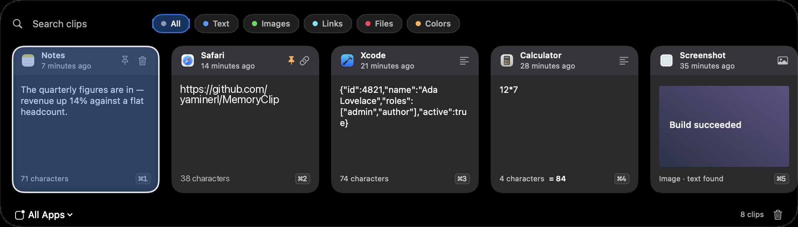

<p align="center">
  
</p>

<h1 align="center">MemoryClip</h1>

<p align="center">Your clipboard, remembered. Locally.</p>

<p align="center"><a href="https://github.com/YamineRL/MemoryClip/actions/workflows/ci.yml"></a></p>

A local-first, privacy-focused menu-bar clipboard manager for macOS. MemoryClip keeps
a history of everything you copy and gives you keyboard-first access to it. It also
notices the screenshots you take, reads the text out of them — in 30 languages, with a
translation into English when it is not one you read — and turns one into a note in
**[Obsidian](https://obsidian.md)** or any other folder of Markdown files, in Apple Notes,
or through a Shortcut.
**Zero network calls**: no sync, no analytics, no accounts. Clips live in a local
SwiftData store on your Mac, the text read out of your screenshots is recognised here,
and the models that tidy it up and translate it run here too. The only files MemoryClip
writes anywhere else are the notes you ask it for, in the folder you chose.

Notes are plain `.md` files with YAML front matter, so they open in
**[Obsidian](https://obsidian.md)** (embeds and Dataview-queryable properties included),
**[Logseq](https://logseq.com)**, **[iA Writer](https://ia.net/writer)**,
**[Zettlr](https://www.zettlr.com)**, **[Typora](https://typora.io)**,
**[Joplin](https://joplinapp.org)**, **[DEVONthink](https://www.devontechnologies.com/apps/devonthink)**,
Obsidian-compatible mobile readers, or a text editor — see
[Where notes go](#where-notes-go).

Requires macOS 26 on Apple silicon.

## Screenshots

<table>
  <tr>
    <td colspan="2"></td>
  </tr>
  <tr>
    <td colspan="2" align="center"><em>The panel — <strong>⇧⌘V</strong> from anywhere.</em></td>
  </tr>
  <tr>
    <td width="50%"></td>
    <td width="50%"></td>
  </tr>
  <tr>
    <td align="center"><em>Preview pane — <code>Space</code> to toggle.</em></td>
    <td align="center"><em>Menu-bar dropdown — the last five clips.</em></td>
  </tr>
  <tr>
    <td colspan="2" align="center"></td>
  </tr>
  <tr>
    <td colspan="2" align="center"><em>Settings — eight panes behind a sidebar, no Dock icon anywhere.</em></td>
  </tr>
</table>

## Install

Download the latest `MemoryClip-<version>.dmg` from
[**Releases**](https://github.com/yaminerl/MemoryClip/releases), open it, and drag
MemoryClip to Applications. This repository holds the source; each release carries
the built disk image as an attachment.

MemoryClip is **ad-hoc signed only** — no Developer ID, no notarisation — so
Gatekeeper blocks the first launch on any Mac that did not build it. Right-click the
app → **Open** and confirm, or strip the quarantine flag:

```sh
xattr -dr com.apple.quarantine /Applications/MemoryClip.app
```

It is a menu-bar agent (`LSUIElement`) with no Dock icon: look for the clipboard
glyph in the menu bar, or press **⇧⌘V** to open the panel. Prefer to build it
yourself? See [Building from source](#building-from-source).

## Getting started

MemoryClip is a menu-bar agent: there is no Dock icon and no window until you ask for
one. On first launch you get a short welcome tour covering the panel hotkey, pasting,
the menu-bar dropdown, and the local-only privacy model. It appears once; you can
replay it any time from **Settings → About → Show Introduction Again**.

From then on, MemoryClip captures every copy in the background. Two ways in:

- Press **⇧⌘V** to open the panel from whichever app you are in.
- Click the **clipboard glyph** in the menu bar for the five most recent clips, plus
  Open MemoryClip, Pause Capture, Clear All History, Export, Settings and Quit.

To have it start with your Mac, turn on **Launch at login** in **Settings → General**.

## Pasting a clip

Open the panel and the list is already focused, newest clip first. Everything is
reachable from the keyboard:

| Key | Does |
| --- | --- |
| `↑` `↓` | Move through the list (`←` `→` as well, while the search field is empty) |
| `Return` | Paste the selected clip |
| `⇧Return` | Paste it as **plain text**, dropping fonts and colours |
| `⌘1`–`⌘9` | Paste any of the first nine results directly |
| `Space` | Toggle the preview pane, while the search field is empty |
| `Esc` | Close the preview, then the panel |

Pasting puts the clip on the clipboard, brings your previous app back to the front,
and sends a ⌘V for you. If macOS blocks that synthetic keystroke the clip is still on
the clipboard, so ⌘V yourself and nothing is lost — see [Permissions](#permissions)
for why, and **Settings → General** to turn the attempt off entirely.

## Finding a clip

Type in the search field to match across clip text, the text recognised inside an image,
whatever the on-device model made of it, colour values, file names and the name of the
app a clip came from. Alongside it are filter chips — **All, Text, Images,
Links, Files, Colors** — and you can narrow to a single source app ("copied from
Safari").

Search stays fast on a large history because the database does the work, not an
in-memory list. Results arrive in pages of 200, pulling in more as you reach the end of
the list, so while further pages are still loading the footer reads `200+ clips` rather
than an exact count. Paging bounds what is *drawn*, never what is *findable*.

**Screenshots are searchable too.** Text inside image clips is extracted on-device with
the Vision framework, in the background, and folded into search: copy a screenshot,
then find it later by typing words that appear *in* the picture. Those rows say
`text found` under the picture once recognition has run. Toggle in **Settings → Panel**
(on by default; the same switch is repeated in **Screenshots**, because it is what makes
a screenshot findable at all).

## Previewing, and what MemoryClip notices

Press `Space` to open the preview pane, which renders the full clip — text, JSON, rich
text or image — rather than the truncated row. MemoryClip also recognises a few things
as they go past:

- **Type badges** for email addresses, URLs, phone numbers, JWTs and JSON, shown in the
  preview pane.
- **Instant arithmetic** — copy `12*7` and the row shows `= 84`. The parser is
  self-contained and deliberately conservative, so date-like strings such as
  `2026-08-07` are never mistaken for sums.
- **QR codes for links** — open a link clip's QR code in a floating window, with a Copy
  Link button. Generated on-device with CoreImage.

## Transforming text

Right-click a clip to rewrite it on the way out — the preview offers the two JSON ones
inline, beside its detection badges:

- **UPPERCASE**, **lowercase**, **Title Case**
- **JSON** format or minify
- **Base64** encode or decode
- **URL** encode or decode
- **Sort lines** or **deduplicate lines**

## Pasting several clips in a row

Queue mode collects clips and pastes them in order. Add them with right-click →
**Add to Queue** (or `q` in vim mode); the footer then shows **Paste N**, which sends
the whole queue to your previous app in the order you marked them, with a short gap
between each.

## Vim navigation

Off by default; enable it in **Settings → Panel**. It is properly modal, and the
current mode shows as a badge in the search bar, so navigation keys never depend on
whether the search field happens to be empty.

In **NORMAL**, letters navigate:

| Key | Does |
| --- | --- |
| `j` `k` | Move down / up |
| `gg` `G` | Jump to top / bottom |
| `⌃d` `⌃u` | Half-page down / up |
| `o` | Paste (`⇧O` pastes as plain text) |
| `p` | Pin the clip |
| `dd` | Delete the clip, after a confirmation |
| `q` | Add the clip to the queue |
| `⇧Q` | Paste the whole queue |
| `/` | Start a fresh search → INSERT |
| `i` | Edit the existing query → INSERT |

In **INSERT**, typing goes to the search field as usual. `Esc` abandons a half-typed
sequence such as a lone `g`, then leaves INSERT for NORMAL.

## Screenshots, and turning them into notes

⇧⌘3, ⇧⌘4 and ⇧⌘5 save a *file* and never touch the clipboard, so a clipboard manager is
structurally blind to them — only ⌃⇧⌘4, the copy-to-clipboard variant, ever reaches the
pasteboard. Turn on **Settings → Screenshots → Keep screenshots in history** and
MemoryClip watches the folder `screencapture` writes to instead, adding each new
screenshot to your history as it lands.

It is **off by default**, because it needs access to a folder macOS guards. The folder
comes from your system screenshot settings (the Desktop, unless you changed it); pick a
different one under **Folder** if you keep them elsewhere. Either way macOS decides
whether MemoryClip may read it — see [Permissions](#permissions).

**It never imports history.** Switching the feature on marks everything already in the
folder as seen, so you get the next screenshot rather than the last four years of them.
Screenshots taken while MemoryClip was closed are still caught up at the next launch,
newest first and bounded, so a folder with a backlog in it cannot flush the rest of your
clipboard history out through the cap.

**A link, not a copy.** The clip points at the screenshot where it already is, plus a
small thumbnail for the row. A day of retina screenshots costs a few kilobytes of
history rather than a few hundred megabytes — and **deleting a clip, letting it expire,
or clearing all history never deletes your file.** Pasting one hands over the file
itself, exactly as copying it in Finder would, and **Reveal in Finder** in the row's
right-click menu opens it where it lives.

Telling a screenshot from any other picture in the same folder is Spotlight's job:
macOS marks every file `screencapture` writes with `kMDItemIsScreenCapture`, which is
exact, and which keeps working whatever you renamed the file prefix to and whatever
language the Mac is in. Spotlight indexes asynchronously, so a file it has no record of
yet falls back to "matches the configured prefix, and was made in the last couple of
minutes" — enough to catch the screenshot from a second ago without adopting every old
PNG on the Desktop.

Screenshots go through the same on-device text extraction as image clips, so you can
find one by what it says. Text extraction detects the language rather than assuming
English, so Arabic, Chinese, Japanese, Korean, Russian, Thai and Ukrainian screenshots
are read as well — 30 languages in all. A screenshot clip is a *file* clip, so it sits under the
**Files** chip rather than **Images**.

### Notes

Any clip with text in it can become a note: right-click and choose **Save as Note**.
Before it is written, the extracted text is passed through **Apple's on-device model**,
which fixes the usual OCR slips, rejoins wrapped lines, drops interface chrome, and
gives the note a title, a summary and a few tags. This happens on your Mac — nothing is
uploaded, and it needs no account and no permission.

The raw extracted text is always kept alongside the tidied version, in the clip and in
the note. Nothing the model writes replaces what was actually on your screen, and a
rewrite that drops or invents too much of the text is thrown away in favour of the raw
recognition. On a Mac where Apple Intelligence is off, unsupported, or still downloading
its model, nothing breaks: the note is written from the raw recognition instead, and
**Settings → Notes** says which of those it is rather than showing a switch that quietly
does nothing.

#### Notes in another language

A screenshot that is not in English gets read in its own language and **translated on
this Mac**. The note carries both: the text exactly as it was on screen, and an English
translation underneath it. The original is the record — a translation never replaces it —
and the note's title, summary and tags are written from the English, so a note captured
in Arabic is still findable in a vault you search in English.

**Settings → Notes → Translation** lists every language Apple can translate into English
(22 on macOS 26) with a checkbox each. Tick as many as you like: those are the languages
MemoryClip will detect and translate, and ticking one whose assets macOS has not
downloaded fetches them — several tick at once and the downloads queue, since a session
can only prepare one pair at a time. With none ticked it translates any language this Mac
can already handle, so the feature works without anyone opening Settings. The packs go
into the store the whole system shares, so a language you fetch here is the same one
Translate and Safari use.

Only the Settings window can start a download — a translation session created off a view
is not allowed to ask — so when MemoryClip meets a language whose assets are missing it
writes the note untranslated rather than failing, and says which language that was. Clips
captured before the download keep the text they were saved with; screenshot the page
again to get a translated note. The switch above the list turns the whole thing off.

Translation is also what makes the on-device model useful here: it reads 23 languages and
Vision now recognises 30, so for a screenshot in the gap — Arabic, Russian, Thai — the
model is given the English translation to clean up, title and tag rather than text it
cannot read.

Three destinations, in **Settings → Notes**:

| Destination | What it does | Needs |
| --- | --- | --- |
| **Markdown folder** | Writes a `.md` file with YAML front matter — an Obsidian vault, or any folder of Markdown. The screenshot is copied in and embedded, so the note survives you clearing your Desktop. | A folder you pick |
| **Notes** | Creates a note in Apple Notes, in a folder you name. The screenshot goes in as a link — Notes does not accept an image through automation. | Automation permission |
| **Shortcut** | Runs a Shortcut with the note as its input, so Bear, Things, DEVONthink or anything else Shortcuts reaches can be the destination. | A Shortcut name |

#### Where notes go

Every note is a plain `.md` file named `2026-08-13 1422 Title.md`, with YAML front matter
(`title`, `created`, `source`, `tags`, `lang`, `memoryclip-uuid`, `screenshot`) above the
text. Anything that reads Markdown off disk can open one. Apps differ on two things only —
whether they understand front matter, and whether they resolve wiki-style `![[embeds]]` —
and the **Copy the screenshot into the folder** switch is what decides which link style a
note gets: on, the screenshot is copied in and embedded as `![[name.png]]`; off, the note
links to it where it sits with an ordinary `[Screenshot](file://…)` link that every editor
renders.

The same guidance is in the app, under **Settings → Notes → Which apps can open these
notes?**

| App | What to pick, and what to set |
| --- | --- |
| **[Obsidian](https://obsidian.md)** | Your vault folder, or any folder inside it. Keep attachment copying **on** — that is what makes the embed resolve. Front matter becomes note properties, so tags work as tags and `lang`, `source` and `created` are queryable from Dataview. |
| **[Logseq](https://logseq.com)** | The `pages` folder inside your graph, with the attachments subfolder set to `assets` — the folder Logseq keeps its files in. It reads front matter and re-indexes new files when the graph is reopened. |
| **[iA Writer](https://ia.net/writer)**, **[Typora](https://typora.io)**, **[Zettlr](https://www.zettlr.com)**, **[Obsidian-compatible editors](https://obsidian.md)**, VS Code | Any folder they already watch. They render standard Markdown, so turn attachment copying **off** — an embed they cannot resolve shows up as literal `![[…]]` text. |
| **[DEVONthink](https://www.devontechnologies.com/apps/devonthink)** | Any folder, then index it (*File → Index Files and Folders*). Indexed notes stay files on disk, so MemoryClip can still update one in place. |
| **[Joplin](https://joplinapp.org)** | Any folder, then import it (*File → Import → MD*). Joplin copies notes into its own database, so later edits from MemoryClip need re-importing. |
| **iCloud Drive, Dropbox, Syncthing** | Any synced folder. Notes are written whole, so a half-written file is never what syncs. |

Bear, Craft, Notion and Things do not keep notes as files — use the **Shortcut**
destination for those, which hands the note to a Shortcut that can put it anywhere
Shortcuts reaches. For Apple Notes, use the **Notes** destination.

The Markdown folder is the default and the only one that asks nothing of any other app:
you pick a folder, MemoryClip writes `.md` files into it, and the screenshot is copied
into an `attachments` subfolder (both names are yours to change). Apple Notes writes into
a folder called `MemoryClip` unless you rename it.

Notes are written **when you ask for one**. If you would rather not ask, turn on
**Write a note for every screenshot** and set how much text a screenshot needs before it
earns one — 80 characters by default, because a busy day of screenshots is otherwise a
busy day of notes. Automatic notes are screenshots only; anything else has to be asked
for. Either way the model works one clip at a time in the background, so a backlog costs
you time rather than a hot Mac.

A clip that already has a note says so — its row reads `Screenshot · noted`, and the
right-click menu offers **Update Note** and **Open Note** instead of **Save as Note**.
Updating rewrites the same file rather than leaving a second copy beside it, and it
follows a note you moved or renamed inside your vault.

### What a Markdown note looks like

Written as `2026-08-13 1422 Deploy checklist.md` — timestamp first, so the folder sorts
chronologically and two screenshots of the same window do not collide:

```markdown
---
title: "Deploy checklist"
created: 2026-08-13T14:22:03Z
source: "Screenshot"
tags:
  - "deploy"
  - "release"
memoryclip-uuid: 5B7C2A19-3E64-4C0F-9A11-8D2F6E0B4A73
screenshot: "/Users/you/Desktop/Screenshot 2026-08-13 at 14.22.01.png"
---

# Deploy checklist

> A four-step release checklist, screenshotted from the team wiki.

![[2026-08-13 1422 Deploy checklist.png]]

1. Freeze the branch and tag it.
2. Run the migration on staging.
3. Smoke-test the queue workers.
4. Announce in #releases.

## Original text

*Exactly as recognised, before the on-device model cleaned it up.*

Deploy checklist
1. Freeze the branch and tag it.
2. Run the migra- tion on staging.
…
```

Every string is quoted on purpose: the input is text read off a screen, and a heading
that happens to contain a colon would otherwise rewrite the note's own metadata. The
`screenshot:` key always points at the **original** file even when a copy was made — it
is the way back to the full-resolution picture. `memoryclip-uuid` is what lets a
re-export find the note it wrote last time. `created` is UTC because Dataview and every
other front-matter reader parses it; the file name is in your local time, because you
are the one who remembers taking the screenshot at 14:22.

## Keeping your history tidy

- **Pin** a clip to keep it regardless of the limits below; **delete** individual clips
  from the row actions or with `dd`.
- **History cap** — the newest 200 clips are kept by default, pinned clips exempt.
  Change it in **Settings → History**.
- **Retention** — clips older than 30 days are swept by default. Also
  **Settings → History**.
- **Pause capture** from the menu bar when you would rather it did not watch; the icon
  switches to a pause glyph while paused.
- **Clear All History** from the menu-bar dropdown, or the nuke-all button in the panel.
  Both confirm first.

Re-copying something you already have does not create a duplicate — it bumps the
existing clip back to the top.

## Exporting your history

Export to **JSON** or **CSV** from the menu-bar dropdown. Large histories stream to
disk one clip at a time rather than being assembled in memory first. With the Touch ID
lock on, exporting always re-authenticates.

## Privacy and security

Everything happens on this Mac. Clips live in a local SwiftData store, and MemoryClip
makes no network calls at all — no sync, no accounts, no analytics.

- **The store is owner-only.** It sits at
  `~/Library/Application Support/app.memoryclip/MemoryClip.store`, with the
  directory at `0700` and the store files at `0600`, so no other local account can read
  your clip history.
- **Password managers are skipped.** MemoryClip respects the standard pasteboard opt-out
  markers (`org.nspasteboard.TransientType`, `AutoGeneratedType`, `ConcealedType`), and
  skips captures from known credential apps outright.
- **Card numbers are never captured.** Luhn-validated card numbers are dropped from
  plain text, from rich text, and from text extracted out of images by OCR. Toggle in
  **Settings → Privacy**.
- **Detection is app-identity based** — MemoryClip matches on the source app's bundle
  identifier and name, and never reads window titles or the screen. That is why it needs
  no Screen Recording or Accessibility permission to do any of this.
- **Screenshots are referenced, not copied.** A screenshot clip holds the path to your
  file and a thumbnail. MemoryClip never moves, rewrites or deletes the file — removing
  the clip removes only the clip. The one time it reads the pixels back out is to make a
  thumbnail, to recognise the text, and — if you write a Markdown note — to copy the
  picture into your vault so the note can embed it. The original is untouched either way.
- **The local model is local.** Text cleanup uses Apple's on-device model through the
  Foundation Models framework. There is no cloud fallback, no request leaves the
  machine, and refinement is skipped entirely when the model is unavailable — the raw
  extracted text is used instead.
- **Translation is local too.** Translating a note uses Apple's Translation framework,
  which runs on the Mac with language assets macOS downloads once. Nothing is sent
  anywhere, and a card number that survived recognition is dropped from the translation
  as well as from the refined text.
- **Notes leave the store on purpose.** A note is a file in the folder you chose, with
  that folder's ordinary permissions — not the `0600` clip store. Card numbers are
  dropped from refined text before it can be written, but everything else in a note is
  as readable as any other document you own.
- **Optional Touch ID lock** (**Settings → Privacy**, off by default) gates the panel
  behind LocalAuthentication, with passcode fallback. With it on, the menu-bar dropdown
  redacts clip previews to their kind ("Text clip", "Link") and pasting from it
  authenticates. One successful unlock covers the panel and the dropdown for a short
  window, but **Export** and **Clear All History** always re-authenticate.

MemoryClip is built to be usable with VoiceOver: clip rows carry labels describing the
clip's kind, content and state, selection changes and mode switches are announced, and
every row action — pin, delete, queue, QR, transforms — is reachable from the keyboard.

## Permissions

MemoryClip requires **no permissions** to do its core job: capture, store, search, and copy
clips back to the clipboard. Nothing else is requested: no Screen Recording, no
Input Monitoring, no network. The Touch ID lock (optional, off by default) uses the
system's built-in LocalAuthentication prompt and needs no grant of its own.

Optional, and only if you use the matching feature:

- **Files and folders** — reading your screenshot folder, and writing notes into the
  folder you pick. macOS guards the Desktop, Documents and Downloads, so the first time
  MemoryClip reads or writes in one of them it asks; allowing it is enough. Choosing the
  folder yourself in **Settings → Screenshots** or **Settings → Notes** is the other way
  in, and the one to use for a folder anywhere else. Either grant is remembered as a
  *security-scoped bookmark* rather than a path, because a stored path would survive a
  relaunch and the access would not. MemoryClip never reaches into a folder you did not
  point it at.
- **Automation (Notes)** — only when you set Notes as your note destination. macOS asks
  the first time. Every other destination, the screenshot watcher and the on-device
  model need no permission at all.

Optional: if you grant MemoryClip **Accessibility** access (System Settings → Privacy &
Security → Accessibility), it will also *auto-paste* the selected clip into your
previous app by posting a synthetic ⌘V. Without the grant, macOS may drop that
synthetic keystroke — the clip is still placed on the clipboard, so you just paste
manually with ⌘V. (The "Auto-paste" toggle in Settings lets you disable the attempt
entirely.)

## Settings

Eight panes, grouped in a sidebar:

| Group | Pane | Contains |
| --- | --- | --- |
| General | **General** | Launch at login, theme, auto-paste |
| General | **Shortcuts** | The global hotkey recorder, plus a full key reference |
| Clipboard | **History** | History cap, retention window |
| Clipboard | **Panel** | Image OCR, vim navigation |
| Clipboard | **Privacy** | Touch ID lock, sensitive-content filtering, permission notes |
| Screenshots | **Screenshots** | Screenshot capture, the folder to watch, image OCR |
| Screenshots | **Notes** | The on-device model, note destination, automatic notes |
| — | **About** | Version, privacy summary, replay the welcome tour |

↑/↓ move between panes from the keyboard, Tab reaches the controls in the pane, and the
window reopens on whichever pane you left it on.

The panel hotkey is rebindable from **Shortcuts** — ⇧⌘V is only the default.

## With a large history

MemoryClip is built to stay quick with a real history, not just a demo-sized one:

- **Opening the panel and typing in it is instant regardless of how much history you
  have.** Search and filtering run in the database over an index, and the list fetches
  only the page it is showing, so a store with tens of thousands of clips opens and
  filters as fast as a nearly empty one.
- **Image clips do not cost memory just by being in the list.** Rows draw from a small
  thumbnail, so scrolling past hundreds of screenshots does not pull hundreds of
  megabytes into memory. Only the clip you actually open reads its full image.
- **Every ⌘C costs the same** whether your cap is 200 or 5000 — trimming happens in the
  database rather than by loading old clips.
- **Launch is not held up by housekeeping.** Retention sweeps, cap enforcement and image
  processing start a couple of seconds after the menu bar is up, so the app is usable
  immediately even on a big store.
- **Text extraction runs in bounded bursts**, several images at a time with pauses, so a
  backlog of screenshots is worked through without taking the machine over.
- **Refinement runs one clip at a time**, also in bounded bursts. The on-device model is
  a single shared resource, so asking it for several notes at once would buy contention
  rather than speed; a backlog is drained in the background instead.

## Building from source

```sh
swift Scripts/make_icon.swift   # regenerate Resources/AppIcon.icns (committed; rarely needed)
./Scripts/make_app.sh           # release build + dist/MemoryClip.app (ad-hoc signed)
./Scripts/make_dmg.sh           # the above, plus dist/MemoryClip-<version>.dmg
open dist/MemoryClip.app
```

`make_app.sh` generates the icon itself if `Resources/AppIcon.icns` is missing, so
`make_icon.swift` only needs running when the artwork changes.

Everything lands in `dist/`, which is gitignored: **no build output is ever committed.**
The DMG reaches users through Releases instead.

### Cutting a release

```sh
./Scripts/publish_release.sh            # tag = v<bundle version>
./Scripts/publish_release.sh v0.2.42    # explicit tag
DRAFT=1 ./Scripts/publish_release.sh    # draft, to eyeball first
```

The script builds the DMG, tags the commit, creates the GitHub release, and attaches the
disk image with its `sha256` in the notes. It refuses to run on a dirty tree or on a
commit that has not been pushed — a published binary should always correspond to source
anyone can fetch. Needs the [GitHub CLI](https://cli.github.com), authenticated with
`gh auth login`.

Version numbers come from `CFBundleShortVersionString` in `Resources/Info.plist`;
bump it there and the app, the DMG name and the tag all follow.

### Develop and test

```sh
swift build   # debug build
swift run     # run from the debug build
swift test    # unit tests (store, parser, transforms, detection, calc, QR,
              # sensitive filter, export, OCR, vim keys, settings support,
              # onboarding flow, search predicate, thumbnails, maintenance
              # scheduling, store rename migration, screenshot detection and
              # watching, the refinement guard, note composition and note sink
              # configuration — 519 tests)

MEMORYCLIP_BENCH=1 swift test    # the above plus the benchmarks (slow)
```

The benchmarks (`PerformanceBenchmarks`, `PanelQueryBenchmarks`,
`OCRPipelineBenchmarks`, plus a few elsewhere) are skipped unless `MEMORYCLIP_BENCH=1`
is set: they build stores of up to 50k clips and take several minutes. They
mostly report timings and memory rather than asserting fixed thresholds — a
measuring tool rather than a regression gate.

### Architecture

```
Sources/MemoryClip/
├── App/            main (AppKit entry + main menu), AppDelegate (wiring),
│                   AppearanceSetting, HotKeys, Log
├── Capture/        PasteboardWatcher (changeCount polling), ContentParser (type
│                   detection + SHA-256 hashing), CapturedClip (parsed payload),
│                   SensitiveFilter (card numbers + credential apps),
│                   TextDetector (email/URL/phone/JWT/JSON badges),
│                   ScreenshotDetector (where screenshots land, and what is one),
│                   ScreenshotWatcher (folder watch → referenced clips)
├── Store/          ClipItem (SwiftData model, incl. ImagePayload — pasteboard
│                   bytes or a referenced file — plus the OCR, refinement and
│                   note fields), ClipStore (insert/dedup/fetch, screenshot
│                   references, cap & retention enforcement)
├── Actions/        PasteService (writes clip to pasteboard, posts ⌘V via CGEvent),
│                   TransformService (text transforms), CalcEvaluator (instant
│                   arithmetic), QRService (CoreImage QR), ExportService (JSON/CSV),
│                   OCRService + OCRCoordinator (Vision text extraction, from a
│                   data blob or a file on disk)
├── Notes/          NoteRefiner (protocol, passthrough, hallucination guard) +
│                   FoundationModelsRefiner (on-device cleanup), NoteTranslator
│                   (protocol, language detection, bounds) + AppleTranslator
│                   (on-device translation), NoteDraft,
│                   NoteComposer (Markdown/HTML/file names), NoteSink +
│                   MarkdownVaultSink / NotesAppSink / ShortcutSink,
│                   NoteCoordinator (refinement drain + export), NoteSettings
├── Security/       AppLockService (optional Touch ID / passcode gate)
├── UI/             PanelController + PanelView (search, smart filters,
│                   keyboard-first card strip), ClipCardView, PreviewView
│                   (Space-toggle preview pane), VimNavigator (the modal state
│                   machine), QRWindowController, StatusController (menu-bar
│                   dropdown + export), SettingsWindowController + SettingsView
│                   (sidebar of eight preference panes) + SettingsSupport (version
│                   info, shortcut reference), DesignSystem, ClipDisplay,
│                   OnboardingController + OnboardingView (first-run tour)
└── Support/        NSColor+Hex, FolderBookmark (security-scoped bookmarks for the
                    folders the user picked, so the grant outlives a relaunch)

Resources/Info.plist    LSUIElement app metadata (bundle id, version, icon name)
Resources/AppIcon.icns  app icon, generated by Scripts/make_icon.swift (committed)
Scripts/make_icon.swift draws the icon set → Resources/AppIcon.icns
Scripts/make_app.sh     release build → dist/MemoryClip.app (ad-hoc signed)
Scripts/make_dmg.sh     make_app.sh + drag-to-install dist/MemoryClip-<version>.dmg
Scripts/publish_release.sh  tag + GitHub release with the DMG attached
```

Screenshot flow: `screencapture` writes a file → `ScreenshotWatcher` debounces the folder
event, asks `ScreenshotDetector` whether the file is a screenshot at all, and waits for
it to stop growing → `ClipStore.insertScreenshot` records a *reference* → the thumbnail
backfill and `OCRCoordinator` read the pixels straight off disk → `NoteCoordinator`
identifies the language and, when it is not English, translates the text with
`AppleTranslator`, then refines whichever of the two the on-device model can read,
bounded by `RefinementGuard` → a `NoteSink` writes the note, on request or
automatically.

Paste flow: panel/dropdown selection → `PasteService.write` puts the payload on the
general pasteboard → watcher is told to ignore its own write → previous app is
reactivated → synthetic ⌘V (when auto-paste is on and permitted).

## Prior art

MemoryClip is inspired by [Deck](https://github.com/yuzeguitarist/Deck) — a
**clean-room implementation**, containing **no Deck code**. Where the two diverge it is
deliberate: the design notes in `DesignSystem.swift` and `ClipCardView.swift` record
which of Deck's visual choices were kept and which were not.
